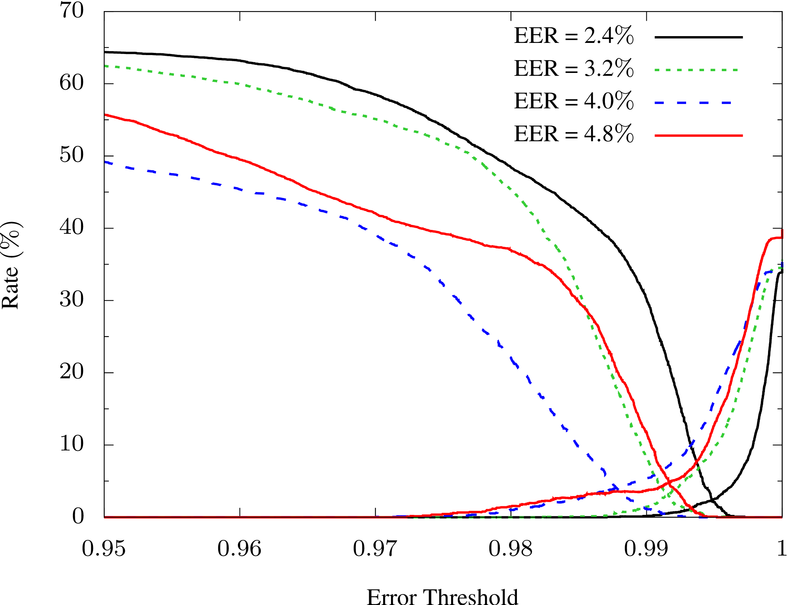
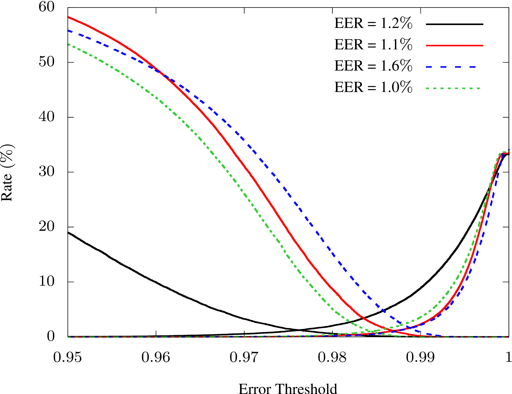

# Speakers Comparison

On input speeches are provided and we need to define whether they belong to the same person.
To answer this question, we train the model that converts each speech into a feature vector. By measuring the cosine similarity between the vectors corresponding to the different speeches, we make a prediction whether the speaker is the same or not.

The training is performed on the dataset of clean speeches from [OpenLSR](https://www.openslr.org/resources/12/train-clean-100.tar.gz) as follows
1. For each speech, an audio embedding is obtained with the use of [OpenL3](https://openl3.readthedocs.io/en/latest/)
2. The classification problem is solved with the embeddings from OpenL3 playing the role of the input layer.
3. The layer before the last one is used to construct the feature vectors of speeches and evaluate equal error rate (EER) with the metrics defined by the cosine similarity
4. The trained model and the threshold value corresponding to the EER is further used to compare speakers, which were never heard before

## Details on the model construction

OpenL3 can provide embeddings of the length 512 or 6144 for sounds corresponding to the environment or music. Here we utilze the default values, namely, the content type is set to "music" and the embedding size is 6144.

To solve the classification problem the fully-connected neural network with one hidden layer of 512 neurons is used.

First, one needs to decide how many speeches will be used for each speaker in course of training. For this purpose we have calculated EER for 1,3, and 10 speeches per speaker on a small dataset containing only 3 different persons. 
For instance, the graphs for the determination of the EER are presented for the cases of 3 and 10 speeches per speaker. On each graph the results of few launches are shown. 

3 speeches per speaker |  10 speeches per speaker
:-------------------------:|:-------------------------:
  |  

In the table the minimal, maximal, and average values of the EER obtained in 10 launches are listed. 

Speeches per Speaker | min EER (%)| max EER (%)| average EER (%)
-------------------|------|----|---
  1  | 3.7 | 11.6 | 8.3
  3  | 1.3 |  6.9 | 3.4
 10  | 0.8 |  1.8 | 1.2
 
Though the EER for the case when 10 speeches per speaker provide the most accurate result, in what follows we use only 3 speeches per speaker for training the model.

The final classification model is trained on 10 speakers. This model without the last layer is saved to further discriminate the speakers.

The EER is calculated on the test set which consists of 10% of the total number of speeches in the dataset. For the trained model the EER is 3%

The code for this section with comments is presented in [Create_the_model.ipynb](Create_the_model.ipynb).

## Details on the speakers comparison part

To test the approach, speeches that were never heard by the model were used. Speakers both known and unknown for the model are used.

Each speech is divided into slices of 1 second by the OpenL3. To compare two speeches one can use following different approaches:
1. Calculate cosine similarity averaged over all possible slices-slices connections with slices belonging to different speeches.
2. Average over slices the feature vectors obtained from the model, and calculate cosine similarity between them.
3. Average over slices the feature vectors obtained from OpenL3, pass them to the model, and calculate cosine similarity

Here we tried the first two options and found that the second variant shows the best performance.

Launches showed no mistakes in speakers comparison, indicating that the test set was not extensive enough.

The code for this section with comments is presented in [Compare_speakers.ipynb](Compare_speakers.ipynb).

## Possible improvements

Speeches presented in [OpenLSR](https://www.openslr.org/resources/12/train-clean-100.tar.gz) are the segments of the audiobooks. The silence can be found in the speeches of each speaker. This silence may make different speakers closer to each other. To avoid the problems which can arise from this fact one can drop these slices.

It is also interesting to investigate the performance of the embeddings of length 512, since less disk space is needed to store these files.

More tests should be performed on a larger number of speakers. 

It is interesting to investigate the performance of the model on the noisy data sets from, e.g., phone calls.

# Usefull References

[1] J.H.L. Hansen and T. Hasan,
''Speaker recognition by machines and humans: A tutorial review'' 
[IEEE Signal processing magazine 32, 74 (2015)](https://www.semanticscholar.org/paper/Speaker-Recognition-by-Machines-and-Humans%3A-A-Hansen-Hasan/c7d244dde874f82e5982e27391251fa66d41de8f#paper-header).

[2] D. Sztaho, G. Szaszak, and A. Beke,
''Deep learning methods in speaker recognition: a review'',
[arXiv:1911.06615](https://arxiv.org/abs/1911.06615).

[3] Z. Bai and X.-L. Zhang,
''Speaker Recognition Based on Deep Learning: An Overview'',
[arXiv:2012.00931](https://arxiv.org/abs/2012.00931).
